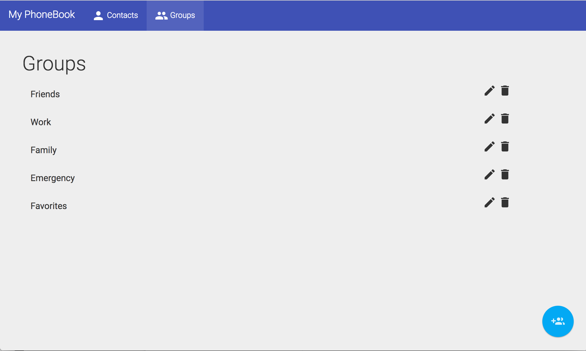

# Phonebook 

[](https://travis-ci.org/shreelekha/phonebook)

## Summary:
This repository provides full source code of a phonebook web app, allowing CRUD operations on contacts and groups via RESTful API written in Spark Java.




## Set up:
### Requirements:
- Java 8

### Source code:
Clone the repository:
```bash
git clone https://github.com/shreelekha/phonebook.git
```

### Run:
We are using Gradle build system. The Gradle binary is located at: `./gradlew`.
1. Execute:
    ```bash
    ~$ ./gradlew run
    ```
2. Open `http://localhost:4567/` in browser.

### Technologies Used:
- Frontend:
    - `AngularJs` 1.6 and `Twitter Bootstrap`.
    - The source code of front-end dashboard is located at `src/main/resources/public/`.
- Backend:
    - [Spark Java microframework](http://sparkjava.com/).
- Database: `SQLite`
    - The database schema is located at `db/schema.sql`.
    - The database file is located at `db/databse.db`.
- REST API:
    - The postman collection is located at: `src/main/postman/Phonebook.postman_collection`.
